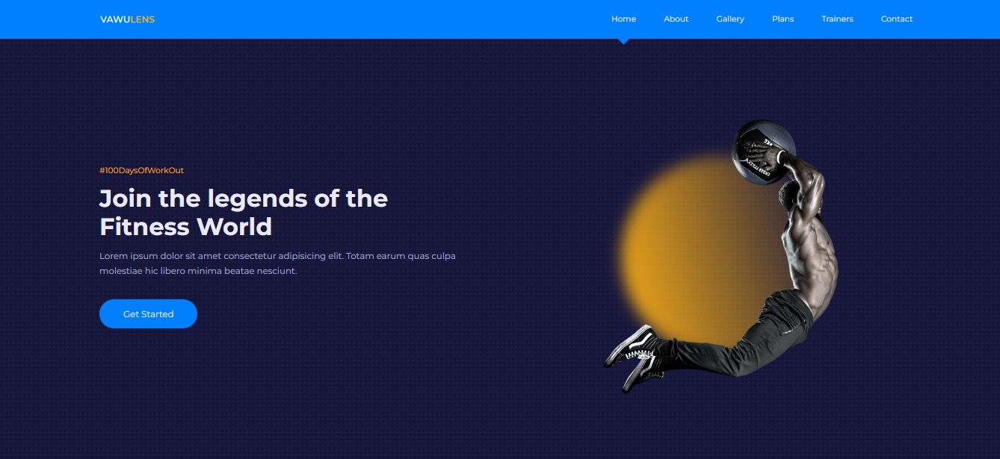
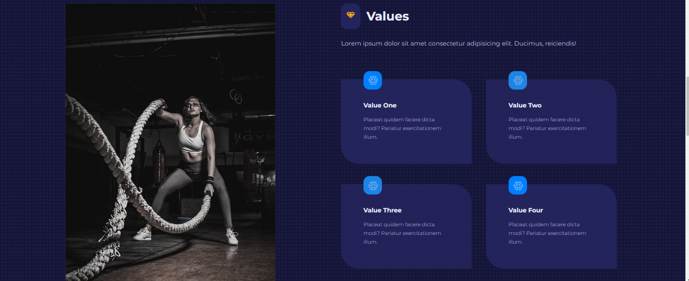
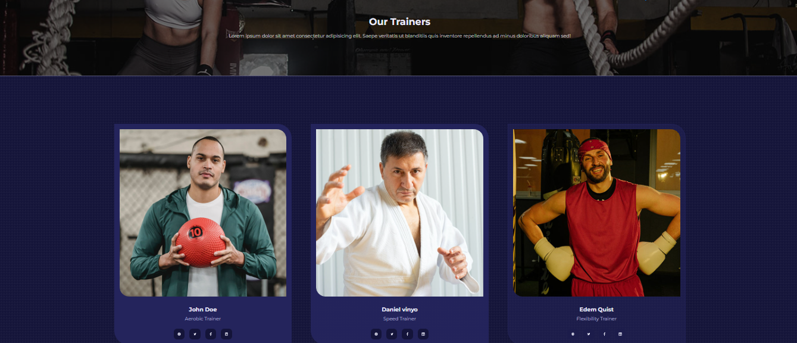

# WORKOUT WEBSITE RESPONSIVE

## <i>Projeto feito com React JS </i>

## Link: https://douglasmonteirodev.github.io/builds/workout-website/

      
 

 

      
 

 

      
 

## Objetivo:

### Foi criar um site básico de treinos totalmente responsivo, o foco foi mais um impacto visual com imagens chamativas e funcionalidades simples mas bastante utéis.

## Descrição

### O site em si possui várias páginas, onde foi utilizado react-router-dom para criar as rotas.

### <i> PÁGINAS: </i>

- `ABOUT`
- `GALLERY`
- `PLANS`
- `TRAINERS`
- `CONTACT`

## <i>Douglas Monteiro</i> 😁🔥🚀
